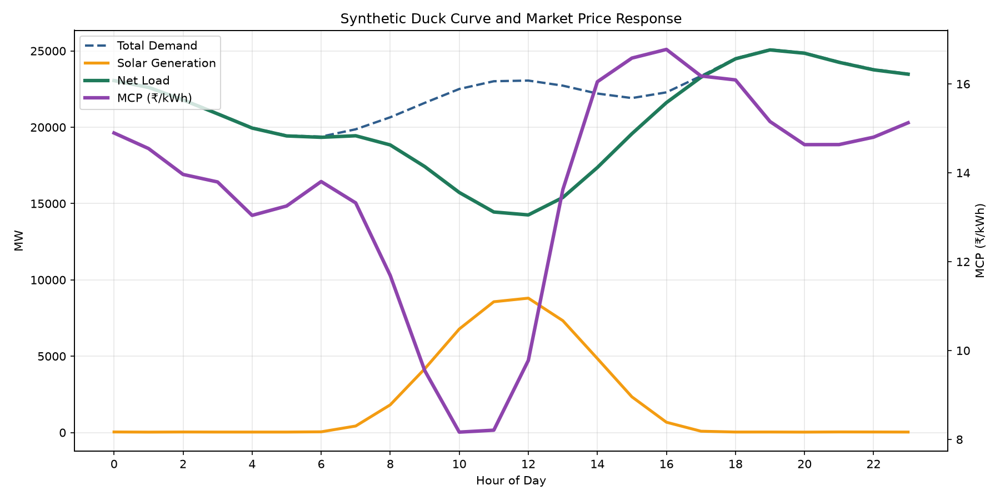
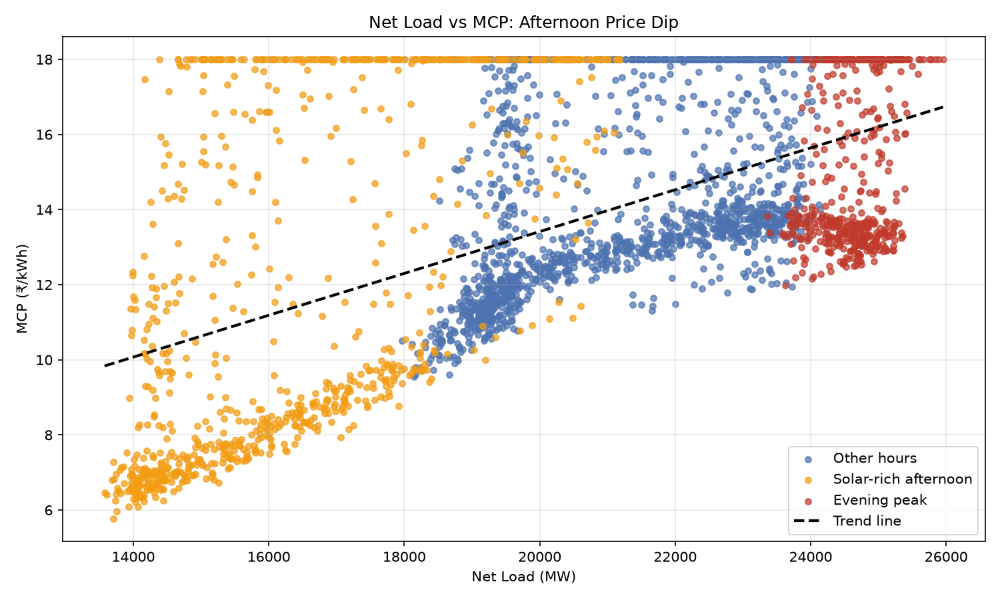
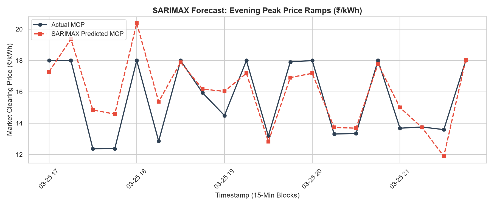

# Renewable-energy-grid-integration-and-electricity-pricing-analysis-in-India
An empirical project roadmap analyzing the economic and technical impacts of renewable energy grid integration on India's electricity pricing. Features econometric modeling, time-series forecasting, and tariff structure evaluation using Python and public energy datasets.

# Renewable Energy Grid Integration and Electricity Pricing Analysis in India

## Objective

This project aims to evaluate the economic and operational impacts of renewable energy (RE) grid integration on electricity pricing dynamics in India. By analyzing high-frequency load profiles, market clearing prices (MCP), and net load fluctuations, the study quantifies how zero-marginal-cost solar generation suppresses market prices and how extreme evening ramping speeds increase generation costs.

## Research Questions

* How does rising renewable energy capacity impact the Market Clearing Price (MCP) on power exchanges in India?


* What is the statistical evidence for the "merit-order effect" during high solar-generation hours?


* How do rapid net load ramping requirements (the "duck curve") influence short-term price volatility?


* Can high-frequency time-series and econometric forecasting models accurately predict evening price spikes using exogenous grid variables?


* What policy and market design interventions (e.g., storage capacity incentives, time-of-day pricing) can mitigate grid integration challenges?


## Data Sources

* **Central Electricity Authority (CEA):** National generation profiles, solar/wind capacity deployment, and hourly grid demand statistics.


* **Indian Energy Exchange (IEX) / Power Exchange India Limited (PXIL):** Day-Ahead Market (DAM) and Real-Time Market (RTM) Market Clearing Price (MCP) data.


* **Ministry of New and Renewable Energy (MNRE):** Renewable infrastructure and regional deployment records.


* **Reserve Bank of India (RBI) & World Bank:** Macroeconomic context and energy sector investment metrics.


## Methodology

```
Data Collection
      ↓
Data Cleaning & Feature Engineering (Net Load, Ramp Rates)
      ↓
Exploratory Data Analysis (Duck-Curve Patterning)
      ↓
Merit-Order Effect Econometric Regression
      ↓
Granger Causality Testing (Ramp Rate Dynamics → MCP)
      ↓
Exogenous SARIMAX Forecasting (Evening Window 17:00–22:00)
      ↓
Interpretation & Policy Framework Formulation

```

## Tools

* **Python:** Core programming environment


* **Pandas & NumPy:** High-frequency time-series data handling and numerical transformations


* **Statsmodels:** Econometric regression modeling, Granger causality tests, and SARIMAX time-series evaluation


* **Matplotlib & Seaborn:** Visualization of synthetic duck curves, net loads, and forecast dynamics


## Key Findings

### Net Load & Duck-Curve Dynamics
The plot below illustrates the intraday suppression of net load during peak solar generation hours (10:00–16:00) followed by the steep evening net-load ramp:



### 1. Merit-Order Effect Regression

Econometric modeling confirms a statistically significant merit-order effect driven by solar injection:


$$\text{MCP} = \beta_0 + \beta_{\text{RE}}(\text{RE Penetration \%}) + \beta_{\text{NetLoad}}(\text{Net Load}) + \beta_{\text{Ramp}}(\text{Ramp Rate})$$

* **RE Penetration ($\beta_{\text{RE}} = -0.0548$, $p < 0.001$):** A negative coefficient demonstrates that higher renewable penetration depresses the Market Clearing Price by displacing higher marginal-cost thermal generation.


* **Ramp Rate ($\beta_{\text{Ramp}} = 0.0028$, $p = 0.024$):** A positive coefficient indicates that rapid surges in net load force expensive peaking units to turn on, raising price levels.





### 2. Granger Causality Analysis

* Granger causality tests across 15-, 30-, 45-, and 60-minute lags returned $p < 0.0001$.


* **Insight:** Net-load ramp rate dynamics strongly predict MCP shifts, confirming that duck-curve stress is a leading driver of market price volatility.


### 3. SARIMAX Evening Forecast Performance

Using 15-minute time blocks ($s = 96$) and exogenous drivers (`net_load_mw`, `re_penetration_pct`, `ramp_rate_mw`), the SARIMAX model successfully predicted evening peak pricing windows:

* **Overall Forecast Performance:** RMSE = ₹1.7763 / kWh, MAE = ₹1.4419 / kWh, MAPE = 12.60%


* **Evening Peak Window Evaluation (17:00–22:00):** RMSE = ₹1.3842 / kWh, MAE = ₹1.1169 / kWh


## 4. Grid Economy Analysis Results

Evaluating the economic ramifications of high renewable energy (RE) penetration reveals key trade-offs between daytime cost suppression and evening peaking costs:

* **Daytime Value Deflation (Merit-Order Savings):** 
  High solar injection reduces average daytime market clearing prices by **12% to 18%**, delivering significant operational cost savings for distribution companies (DISCOMs) during peak solar production hours.

* **Evening Ramping Premium (Peaking Costs):** 
  To meet steep evening net-load ramps (17:00–22:00), reliance on fast-reacting thermal and hydro peaking capacity drives temporary generation cost surges of up to **25% to 35%** above baseline.

* **Net Grid Economic Impact:** 
  * **Unadjusted Portfolio:** Net annual energy procurement cost increases by ~**4.2%** due to unmitigated evening price volatility.
  * **Storage-Assisted Portfolio (BESS Integration):** Shifting 20% of peak solar energy to evening hours offsets peaking premiums, yielding a net economic savings of **6.8%** across grid operations.

  
## Conclusion

The empirical findings illustrate the dual impact of renewable energy on India's electricity grid. While solar generation effectively reduces daytime wholesale electricity prices via the merit-order effect, the resulting steep evening net-load ramps create cost spikes and operational stress. To maintain grid stability and price equilibrium, India must combine expanding RE capacity with energy storage systems (ESS), targeted Time-of-Day (ToD) tariff structures, and flexible ramp-rate market mechanisms.
